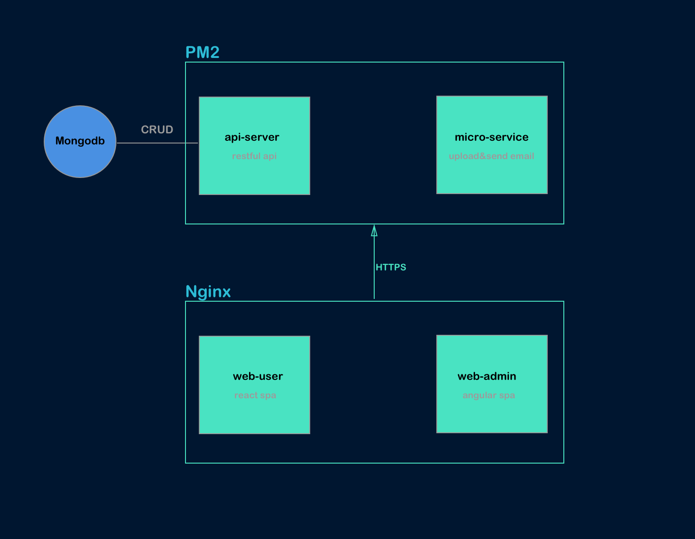

# What?
Hi, welcome to `tsq-me` document. tsq-me is a **project** like `wordpress` which has an [admin platform](https://admin.tsq.me) to manage assets and has a [user platfrom](https://tsq.me) for showing something.

Until now, this project contains five code repositories hosted in [Github](https://github.com/tsq-me) and they are all public.

# Why?
I'm `tsq`. The name `tsq` is my github username. I'm a web developer. One year ago, I have an ideal to build a web platform to show my favorite photos, videos, music and stories. During the progress of the development, I can apply a lot of IT knowledge what I learnt. I hope I can write high quality code and make a beautiful interface.

# Features

* All http request are transfered by **HTTPS**
* All static assets are accelerated access by **CDN**
* All service are **automated deployment**. see [detail]()
* All html pages are responsive and **mobile first**.
* Just **one** server machine and **one** top-level domain.

# Skills

Theme | Keywords
----- |--------------
AngularJS | `Angular2`, `Typescript`, `Rx.JS`
ReactJS   | `Webpack`, `React`, `Redux`, `React-router`, `HMR`
CSS       | `Bootstrap4`, `Precss`, `SASS`, `Postcss`, `Responsive`, `Mobile First`
Nodejs    | `Express`, `Restful API`, `JSON Web Token`, `Micro service`, `API Doc`, `ES6`
Test      | `Unit Test`, `Mocha`, `ESlint`, `Stylelint`, `Istanbul`
Database  | `Redis`, `Mongodb`
Linux     | `Ubuntu`, `Nginx`
Cloud     | `ECS`, `OSS`, `CDN`, `Cert`, `DNS`, `Email`
Other     | `HTTPS`, `Webhook`, `AutoDeploy` , `Github`

# Repositories

Github | Description
--------|------------
[web-user]() | webapp for user: https://tsq.me
[web-admin]() | webapp for admin: https://admin.tsq.me
[api-server]()| api server for webapp: https://api.tsq.me/apidoc
[micro-service]() | micro service for webapp
[deploy-server]() | deploy tool for api-server,micro-service, web-user and web-admin

# Preview

### web-user
https://tsq.me

*Mobile:*

<iframe src="https://tsq.me" style="width: 375px; height: 576px;" frameborder="0"></iframe>


*PC:*

<iframe src="https://tsq.me" style="width: 100%; height: 640px;" frameborder="0"></iframe>

### web-admin
https://admin.tsq.me

*Mobile:*

<iframe src="https://admin.tsq.me" style="width: 375px; height: 576px;" frameborder="0"></iframe>


*PC:*

<iframe src="https://admin.tsq.me" style="width: 100%; height: 640px;" frameborder="0"></iframe>

# Cloud Server Machine

### Configuration

```
OS:         Ubuntu 14.04 64
CPU:        1
Memory:     1G
Disk:       20G   
Bandwidth:  1Mbps           
```

### Init

```shell
# update apt-get
apt-get update

# install git
apt-get install -y git

# install zsh
apt-get install -y zsh

# install unzip
apt-get install -y unzip

# install redis
apt-get install -y redis-server

# install oh-my-zsh
sh -c "$(curl -fsSL https://raw.github.com/robbyrussell/oh-my-zsh/master/tools/install.sh)"

# install nvm
curl -o- https://raw.githubusercontent.com/creationix/nvm/v0.32.1/install.sh | bash

# config nvm in .zshrc
export NVM_DIR="/root/.nvm"
[ -s "$NVM_DIR/nvm.sh" ] && . "$NVM_DIR/nvm.sh"  # This loads nvm
export NVM_NODEJS_ORG_MIRROR=https://npm.taobao.org/mirrors/node

# install node
nvm install v6.9.1

# install cnpm
npm --registry=https://registry.npm.taobao.org install cnpm -g

# install pm2
cnpm i pm2 -g

# mkdir directories
cd ~/ && mkdir github release www backups scripts upload

# mongodb https://docs.mongodb.com/manual/tutorial/install-mongodb-on-ubuntu/     
```

### Directory structure

```
~/
├── release              # full application packages
│   ├── api-server      
│   ├── micro-service
│   ├── web-admin
│   └── web-user
├── github              # application source codes cloned from github
│   ├── api-server
│   ├── deploy-server
│   ├── micro-service
│   ├── web-admin
│   └── web-user
└── www                 # static resources serverd by nginx(for web-user & web-admin)
    ├── web-admin
    └── web-user
```


### Nginx Config

Directory structure:

```
/etc/nginx
    |-- cert
        |-- user                # for https://tsq.me
            |-- ****.key
            |-- ****.pem
        |-- admin               # for https://admin.tsq.me
            |-- ****.key
            |-- ****.pem        
        |-- api                 # for https://api.tsq.me
            |-- ****.key
            |-- ****.pem           
        |-- micro-service       # for https://micro-service.tsq.me
            |-- ****.key
            |-- ****.pem        
        |-- cdn                 # for https://cdn.tsq.me
            |-- ****.key            
            |-- ****.pem        
        |-- admin-cdn           # for https://admin-cdn.tsq.me
            |-- ****.key
            |-- ****.pem        
    |-- sites-enabled
        |-- api-server          # nginx config for api-server
        |-- micro-service       # nginx config for micro-service
        |-- admin               # nginx config for web-admin
        |-- user                # nginx config for web-user
        |-- cdn                 # nginx config for cdn
        |-- amdin-cdn           # nginx config for admin-cdn
    |-- ...    
```


Config:

`/etc/nginx/sites-enabled/api`

```
server {
    listen 443;
    ssl on;
    server_name api.tsq.me;
    ssl_certificate   /etc/nginx/cert/api/214029351980031.pem;
    ssl_certificate_key  /etc/nginx/cert/api/214029351980031.key;
    ssl_session_timeout 5m;
    ssl_ciphers ECDHE-RSA-AES128-GCM-SHA256:ECDHE:ECDH:AES:HIGH:!NULL:!aNULL:!MD5:!ADH:!RC4;
    ssl_protocols TLSv1 TLSv1.1 TLSv1.2;
    ssl_prefer_server_ciphers on;
    location / {
      proxy_pass http://localhost:3000;
    }
}
```

`/etc/nginx/sites-enabled/micro-service`

```
server {
    listen 443;
    ssl on;
    server_name micro-service.tsq.me;
    ssl_certificate   /etc/nginx/cert/api/214029351980031.pem;
    ssl_certificate_key  /etc/nginx/cert/api/214029351980031.key;
    ssl_session_timeout 5m;
    ssl_ciphers ECDHE-RSA-AES128-GCM-SHA256:ECDHE:ECDH:AES:HIGH:!NULL:!aNULL:!MD5:!ADH:!RC4;
    ssl_protocols TLSv1 TLSv1.1 TLSv1.2;
    ssl_prefer_server_ciphers on;
    location / {
      proxy_pass http://localhost:4000;
    }
}
```


`/etc/nginx/sites-enabled/user`

```
server {
    listen 80;
    server_name tsq.me;
    return 301 https://$server_name$request_uri;
}

server {
    listen 443;
    ssl on;
    server_name tsq.me;
    ssl_certificate   /etc/nginx/cert/user/213968846340031.pem;
    ssl_certificate_key  /etc/nginx/cert/user/213968846340031.key;
    ssl_session_timeout 5m;
    ssl_ciphers ECDHE-RSA-AES128-GCM-SHA256:ECDHE:ECDH:AES:HIGH:!NULL:!aNULL:!MD5:!ADH:!RC4;
    ssl_protocols TLSv1 TLSv1.1 TLSv1.2;
    ssl_prefer_server_ciphers on;
    root /root/www/web-user/dist;

    try_files $uri $uri/ /index.html;
    location ~* \.(css|js)$ {
        expires max;
    }

    location ~* \.html$ {
        expires 0;
    }

    location ~* \.(eot|svg|ttf|woff|woff2) {
        add_header Access-Control-Allow-Origin *;
    }
}
```


`/etc/nginx/sites-enabled/admin`

```
server {
    listen 80;
    server_name admin.tsq.me;
    return 301 https://$server_name$request_uri;
}
server {
    listen 443;
    ssl on;
    server_name admin.tsq.me;
    ssl_certificate   /etc/nginx/cert/admin/214029332330031.pem;
    ssl_certificate_key  /etc/nginx/cert/admin/214029332330031.key;
    ssl_session_timeout 5m;
    ssl_ciphers ECDHE-RSA-AES128-GCM-SHA256:ECDHE:ECDH:AES:HIGH:!NULL:!aNULL:!MD5:!ADH:!RC4;
    ssl_protocols TLSv1 TLSv1.1 TLSv1.2;
    ssl_prefer_server_ciphers on;
    root /root/www/web-admin/dist;

    try_files $uri $uri/ /index.html;
    location ~* \.(css|js)$ {
        expires max;
    }

    location ~* \.html$ {
        expires 0;
    }

    location ~* \.(eot|svg|ttf|woff|woff2) {
        add_header Access-Control-Allow-Origin *;
    }
}
```
*`cdn` is same as `user` and `admin-cdn` is same as `admin` expect for `server_name`*

### Environment variable

```
export NODE_ENV=production

# for deploy-server
## for log message to wechat
export SERVER_JIANG_KEY=***

## server port
export DEPLOY_PORT=5000

## redis sub channel
export REDIS_CHANNEL=deploy


# for micro-service
## redis password
export REDIS_PASSWORD=***

## server port
export MICRO_SERVICE_PORT=6679


# for api-server
## jwt secret
export SECRET=***

## mongourl
export MONGOURL=***

## micro service url
export MICROURL=***

## server port
export API_SERVER_PORT=3000

## ali secret for oss upload
export ACESS_KEY_ID=***
export ACESS_KEY_SECRET=***

```

### Backup mongodb
`touch ~/scripts/mongo_backup.sh`

```shell
#!/bin/bash
MONGO_DATABASE="mayabi"
APP_NAME="tsq"

MONGO_HOST="127.0.0.1"
MONGO_PORT="27017"
TIMESTAMP=`date +%F-%H%M`
MONGODUMP_PATH="/usr/bin/mongodump"
BACKUPS_DIR="/root/backups/${APP_NAME}"
BACKUP_NAME="$APP_NAME-$TIMESTAMP"

$MONGODUMP_PATH -d $MONGO_DATABASE

mkdir -p $BACKUPS_DIR
mv dump $BACKUP_NAME
tar -zcvf $BACKUPS_DIR/$BACKUP_NAME.tgz $BACKUP_NAME
rm -rf $BACKUP_NAME
```
`chmod +x mongo_backup.sh`

### Schedule Cronjob:
`crontab -e`

```shell
# Remove upload files; Everyday at 23:30
30 23 * * * rm -rf ~/root/upload/*.*
# Backup mongodb; Everyday at 1 a.m.
00 01 * * * /bin/bash /home/username/scripts/mongo_backup.sh
```


# ECS & OSS & CDN & Cert & Email & DNS

I bought those service in the [Aliyun](aliyun.com)

### Introduction

* ECS: https://www.aliyun.com/product/ecs
* OSS: https://www.aliyun.com/product/oss
* CDN: https://www.aliyun.com/product/cdn
* Cert: https://www.aliyun.com/product/cas
* DNS: https://wanwang.aliyun.com/domain
* Email: https://wanwang.aliyun.com/mail

### ECS(Elastic Compute Service)
Just one ECS which contains `mongodb`, `redis`, `pm2`, `nginx`

This ECS is located in `Shanghai, China` and spends `$10` a month. When I have enough money, I will upgrade its configuration.Now, because the bandwidth is just 1M, so it will be very slow when we do upload operation.


### OSS(Object Storage Service)
`OSS is like s3 of AWS`

Our media assets(e.g photo,music,video...) and other assets(e.g css,js...) files will be uploaded to oss

bucket name | bucket location | domain | custom domain
------------|-----------------|--------|---------------
tsq-me-media | tokyo  | tsq-me-media.oss-ap-northeast-1.aliyuncs.com    |  media-cdn.tsq.me
tsq-me-asset | tokyo  | tsq-me-asset.oss-ap-northeast-1.aliyuncs.com    |  asset-cdn.tsq.me


### CDN

There are two kinds of cdn, one is `oss cdn`, the other is `source station cdn`


domain    | cname   | source station    | type
----------|---------|-----------------  |--------
cdn.tsq.me|cdn.tsq.me.w.kunlunar.com| tsq.me:443    | source station
admin-cdn.tsq.me|admin-cdn.tsq.me.w.kunlunca.com|  admin.tsq.me:443 | source station
media-cdn.tsq.me|media-cdn.tsq.me.w.kunlunea.com|  tsq-me-asset.oss-ap-northeast-1.aliyuncs.com:443 | oss
asset-cdn.tsq.me|asset-cdn.tsq.me.w.kunlunca.com|  tsq-me-media.oss-ap-northeast-1.aliyuncs.com:443 | oss


### Cert
Those cert are used by nginx to support https. All of our services are transfered via HTTPS

Now, there are 8 domains using https

```
https://tsq.me                  #   for: web-user index.html
https://admin.tsq.me            #   for: web-admin index.html
https://api.tsq.me              #   for: invoking api server
https://micro-service.tsq.me    #   for: invoking micro service
https://cdn.tsq.me              #   for: using cdn to speed up dist files of web-user
https://admin-cdn.tsq.me        #   for: using cdn to speed up dist files of web-admin
https://media-cdn.tsq.me        #   for: using cdn to speed up media oss
https://asset-cdn.tsq.me        #   for: using cdn to speed up asset oss
```

cert name   | cert binding domain   |   Issuing authority   |   price
------------|-----------------------|-----------------------|-----------
user |   tsq.me  |   Symantec Corporation    | free
admin |   admin.tsq.me  |   Symantec Corporation    | free
api |   api.tsq.me  |   Symantec Corporation    | free
micro-service |   micro-service.tsq.me  |   Symantec Corporation    | free
admin-cdn |   admin-cdn.tsq.me  |   Symantec Corporation    | free
cdn |   cdn.tsq.me  |   Symantec Corporation    | free
media-cdn |   media-cdn.tsq.me  |   Symantec Corporation    | free
asset-cdn |   asset-cdn.tsq.me  |   Symantec Corporation    | free

### Email

account | description
--------|---------------
support@tsq.me | when user need reset password, then use it to send reset link url, used by `micro-service`
i@tsq.me | master account, it's my personal account. I check this email every day


### DNS

The parse settings of the `tsq.me`

Just one Ip , one Domain, one ECS

Record type | from  | to    | Description
------------|-------|-------|--------------
A           | @     | 139.196.58.63 | support: tsq.me
A           | www     | 139.196.58.63 | support: www.tsq.me
CNAME       | api     | tsq.me | support: api.tsq.me
CNAME       | admin     | tsq.me | support admin.tsq.me
CNAME       | cdn     | cdn.tsq.me.w.kunlunca.com | ali cdn config, so now:  https://tsq.me/app.js == https://cdn.tsq.me/app.js
CNAME       | admin-cdn     | admin-cdn.tsq.me.w.kunlunca.com | ali cdn config, so now:  https://admin.tsq.me/app.js == https://admin-cdn.tsq.me/app.js
CNAME       | media         | tsq-me-media.oss-ap-northeast-1.aliyuncs.com | ali oss config. so we can use: media.tsq.me
CNAME       | asset         | tsq-me-asset.oss-ap-northeast-1.aliyuncs.com | ali oss config. so we can use: assets.tsq.me
CNAME       | sjtpmxs2wv41rvmcb7572ne6sl8t2gv3 | s20161208150100.tsq.me | https cert config for https://tsq.me
CNAME       | saqhnxt6i9u0z6d8mhrgiksocxfa3kmk.admin | s20170226150100.admin.tsq.me | https cert config for https://admin.tsq.me
CNAME       | sekql5rqvtjef0dw7cn1gsvn6gfu3ehu.api | s20170226150100.api.tsq.me | https cert config for https://api.tsq.me
CNAME       | srpq0ib2wfbhutlha6a1ka2sf7ijmw9s.admin-cdn| s20161208150100.admin-cdn.tsq.me | https cert config for https://admin-cdn.tsq.me
CNAME       | s83rf1z32q4qbkjru9b09zoitgtlde89.cdn | s20170303150100.cdn.tsq.me | https cert config for https://cdn.tsq.me
CNAME       | mail | mail.mxhichina.com | Email config
CNAME       | smtp | smtp.mxhichina.com | Email config
CNAME       | pop3 | pop3.mxhichina.com | Email config
MX          | @ | mxw.mxhichina.com | Email config
MX          | @ | mxn.mxhichina.com | Email config
TXT         | @ | v=spf1 include:spf.mxhichina.com -all | Email config

# Architecture diagram



------------------------

<p style="text-align:center;font-style: italic;font-size:10px">This document is generated by <a href="https://atom.io/">atom</a><p>
